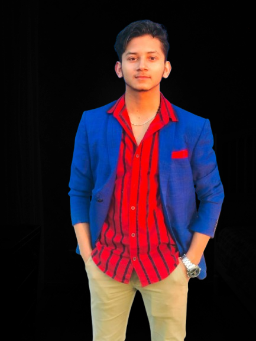

# Nikash Lamsal

 

<table>
<tr>
<td width="50%" align="center">
  

</td>
<td width="50%" align="center">
  

</td>
</tr>
</table>

---

# 🧑‍💻 About Me

Hi! I'm **Nikash Lamsal** — a passionate **Computer Engineering student** at *Tribhuvan University, Nepal 🇳🇵*.

💻 Focused on **Web Development (MERN Stack)**, **Machine Learning**, and **Open Source Contributions**.  
🚀 Currently an **Intern** at **Nobel Navigators**.  
✨ I believe in **building projects**, **solving real-world problems**, and **continuous learning**.

---

# 🛠️ Completed Projects

| 🚀 Project Name | 🔗 Link |
|:----------------|:--------|
| **Interactive Learning Platform** | [View Project](https://link-to-your-project.com) |
| **Neon Space Dodger Game** | [Play Now](https://link-to-your-project.com) |
| **Typing Test Simulator** | [Try Here](https://link-to-your-project.com) |
| **Salary Predictor ML App** | [See Project](https://link-to-your-project.com) |

---

# 📈 GitHub Stats

  

---

# 🤝 Let's Connect

  
  
  

---

  

---

<h3 align="center" style="color: #00FFFF;"><i>“Every bug is a lesson, every fix is growth.”</i> 🛠️</h3>

